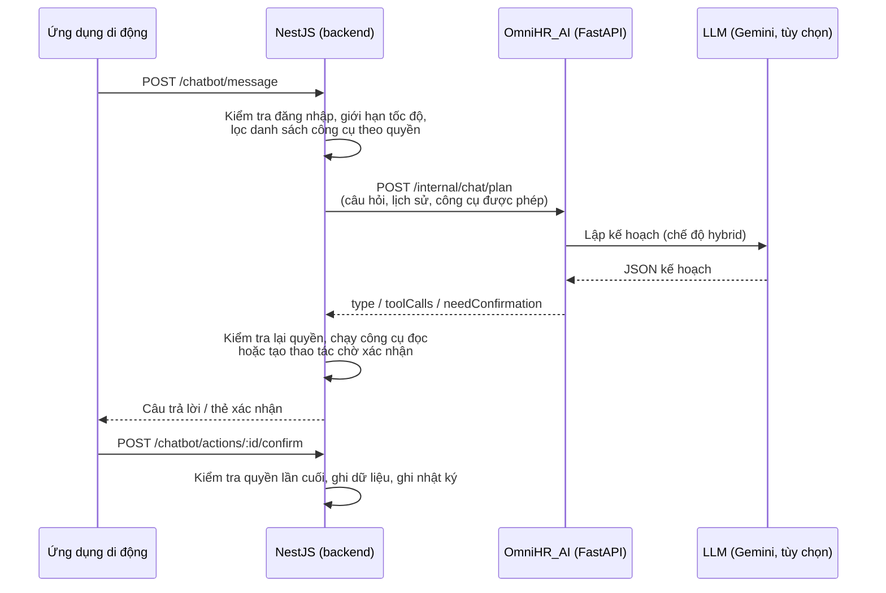

# Trợ lý AI HRGenie trong OmniHR

> Tài liệu mô tả kiến trúc, cơ chế an toàn, khả năng và kết quả đánh giá của chatbot HRGenie.
> Số liệu cập nhật ngày 27/09/2026.

## 1. Mục tiêu

HRGenie là trợ lý hội thoại tiếng Việt trên ứng dụng di động của nhân viên. Nhân viên hỏi bằng ngôn ngữ tự nhiên, ví dụ *"tôi còn bao nhiêu ngày phép?"*, *"xin nghỉ chiều mai vì đi khám"*, *"task Build login xong rồi"*, và HRGenie tra cứu hoặc chuẩn bị thao tác thay cho việc mở từng màn hình.

Ba nhóm việc chính:

- **Tra cứu dữ liệu cá nhân:** chấm công, số ngày phép, đơn nghỉ, task, dự án, kỹ năng, quản lý, đồng nghiệp.
- **Hỏi đáp chính sách:** nghỉ phép, chấm công, phúc lợi, quy tắc ứng xử, trả lời từ tài liệu nội bộ.
- **Thao tác có xác nhận:** tạo đơn nghỉ (kể cả nửa ngày), hủy đơn nghỉ hoặc xin hủy đơn đã duyệt, cập nhật trạng thái task của chính mình.

## 2. Kiến trúc

**Nguyên tắc cốt lõi: dịch vụ AI chỉ lập kế hoạch, không bao giờ ghi dữ liệu.**

- Ứng dụng chỉ gọi backend NestJS. Dịch vụ AI là dịch vụ nội bộ, được bảo vệ bằng `X-Internal-Service-Token`, và không bao giờ nhận yêu cầu trực tiếp từ client.
- Dịch vụ AI trả về một **kế hoạch**: câu trả lời trực tiếp, danh sách công cụ cần gọi, hoặc một thao tác cần người dùng xác nhận.
- Backend là nơi **duy nhất** kiểm tra quyền, đọc và ghi dữ liệu. Một câu trả lời sai của LLM vì vậy không thể vượt qua phân quyền.

## 3. Lập kế hoạch: ba chế độ

| Chế độ | Cách hoạt động | Khi nào dùng |
|---|---|---|
| `rule_based` | Bộ luật nhận diện ý định bằng từ khóa tiếng Việt (có và không dấu) | Không có khóa LLM; chạy offline; kiểm thử |
| `llm` | Gọi LLM qua lớp trừu tượng tương thích OpenAI (đang dùng Gemini) | Thử nghiệm |
| **`hybrid`** (khuyến nghị) | Ưu tiên LLM; **tự quay về bộ luật** khi LLM hết thời gian, trả JSON sai, sai lược đồ, gọi công cụ không được phép, hoặc độ tin cậy dưới 0,6 | Vận hành |

Kế hoạch trả về luôn có cùng một cấu trúc (`type`, `intent`, `reply`, `toolCalls`, `needConfirmation`, `confidence`) ở cả ba chế độ. Nhờ vậy backend không cần biết kế hoạch do LLM hay bộ luật tạo ra.

Dịch vụ AI còn **kiểm tra đầu ra của LLM** trước khi gửi về backend:

- chỉ chấp nhận công cụ nằm trong danh sách backend cho phép với người dùng đó;
- mỗi công cụ chỉ được mang những tham số nằm trong danh sách cho phép (ví dụ đơn nghỉ chỉ có loại nghỉ, ngày bắt đầu/kết thúc, lý do, buổi).

Kế hoạch sai bị loại và thay bằng kế hoạch của bộ luật.

## 4. Công cụ và phân quyền

Backend chỉ gửi cho dịch vụ AI những công cụ mà người dùng **có quyền dùng**. Nhân viên thường không được biết tới các công cụ cấp nhóm.

| Nhóm | Công cụ | Quyền cần có |
|---|---|---|
| Hồ sơ | `get_my_profile`, `get_my_manager`, `get_my_skills`, `get_my_team_members`, `get_my_projects` | Nhân viên |
| Chấm công | `get_today_attendance`, `get_my_attendance_summary`, `get_attendance_policy` | Xem chấm công của mình |
| Nghỉ phép | `get_my_leave_balance`, `get_my_leave_requests`, `get_leave_types` | Xem nghỉ phép của mình |
| Công việc | `get_my_tasks`, `get_my_upcoming_tasks`, `get_my_task_stats` | Xem task của mình |
| Cấp nhóm | `get_team_attendance_summary`, `get_team_task_summary`, `get_who_is_on_leave_today`, `get_upcoming_leaves`, `get_department_headcount`, `get_employee_birthdays` | Quyền xem theo nhóm/toàn công ty |
| **Ghi (có xác nhận)** | `create_leave_request_draft`, `cancel_my_pending_leave_request`, `update_task_status_draft` | Tạo/hủy đơn nghỉ, cập nhật trạng thái task |

**Chặn yêu cầu vượt quyền ngay từ bước lập kế hoạch:** xem lương hay điểm đánh giá của người khác, sửa lương, sửa điểm, sửa giờ chấm công, xin nghỉ hộ người khác… đều bị từ chối, không gọi công cụ nào.

## 5. Thao tác ghi: luôn cần xác nhận

Mọi thao tác ghi đi qua hai bước:

1. **Tạo bản nháp.** Backend kiểm tra toàn bộ nghiệp vụ *ngay lúc này* và lưu một "thao tác chờ xác nhận" có hạn 30 phút. Ứng dụng hiển thị thẻ tóm tắt để người dùng xem lại.
2. **Xác nhận.** Người dùng bấm xác nhận; backend kiểm tra quyền lần cuối, thực hiện, và ghi nhật ký kiểm toán.

Các lỗi nghiệp vụ được báo **trước khi** người dùng xác nhận, không để tới bước cuối mới báo:

| Thao tác | Kiểm tra ở bước nháp |
|---|---|
| Tạo đơn nghỉ | Ngày hợp lệ; không trùng đơn khác (nghỉ sáng và nghỉ chiều cùng một ngày được phép); trừ ngày lễ; **không vượt số phép năm còn lại**; nghỉ nửa ngày chỉ cho đơn một ngày |
| Hủy đơn nghỉ | Đơn đang chờ duyệt thì hủy ngay; đơn **đã duyệt và chưa tới ngày** thì chuyển thành **yêu cầu hủy gửi quản lý**; đơn đã bắt đầu thì không hủy được qua chatbot |
| Cập nhật trạng thái task | Chỉ task được giao cho chính người hỏi, và **chỉ theo luật của người làm**: bắt đầu làm, nộp chờ duyệt, rút về làm tiếp. Nói "xong rồi" nghĩa là **nộp cho quản lý duyệt**. HRGenie **không bao giờ duyệt thay quản lý**, kể cả khi người hỏi là trưởng nhóm |

## 6. Hỏi đáp chính sách (RAG)

Câu hỏi về chính sách được trả lời từ các tài liệu nội bộ dạng Markdown (`chấm công – làm việc`, `nghỉ phép`, `phúc lợi`, `quy tắc ứng xử`). Mỗi mục `##` là một đoạn có thể truy xuất.

- **Hai cách truy xuất kết hợp:**
  - *theo từ khóa* (trọng số IDF và cặp từ liền nhau), luôn chạy được, không cần mạng;
  - *theo embedding* (độ tương đồng cosine), tìm được đúng đoạn dù câu hỏi không dùng chung từ nào. Ví dụ *"được hỗ trợ gì khi ốm đau"* tìm tới mục **Bảo hiểm**.
- **Chống trả lời bừa:** một kết quả embedding chỉ được chấp nhận khi vượt ngưỡng tuyệt đối **và** bỏ xa kết quả thứ hai. Câu hỏi lạc đề thường có điểm cao đồng đều ở mọi đoạn, nên không vượt được điều kiện thứ hai.
- **Không dùng cơ sở dữ liệu vector:** kho tài liệu chỉ vài chục đoạn, quét toàn bộ là chính xác và nhanh hơn một lượt gọi mạng. Vector được lưu đệm trên đĩa, nên chỉ đoạn nào sửa mới phải tính lại.
- Câu trả lời kèm **trích dẫn** nguồn tài liệu.

## 7. Hội thoại, giới hạn và giao diện

- **Lịch sử:** mỗi cuộc hội thoại được lưu; 12 tin nhắn gần nhất được gửi kèm để hiểu ngữ cảnh.
- **Giới hạn:** tối đa 20 tin nhắn/phút/người, dùng chung giữa các máy chủ qua Redis (tự dùng bộ đếm trong tiến trình nếu Redis không có); tối đa 1.000 ký tự/tin.
- **Ngôn ngữ:** lỗi nghiệp vụ được dịch sang tiếng Việt theo mã lỗi (ví dụ hết phép, trùng ngày nghỉ, task đang chờ duyệt).
- **Giao diện:** HRGenie xuất hiện dưới dạng **cây đèn thần** nổi trên màn hình chính, kéo thả được. Khi chạm vào, thần đèn bay ra từ vòi đèn và mờ dần vào màn hình chat. Thao tác cần xác nhận hiển thị thành thẻ có nút *Xác nhận* / *Hủy*.

## 8. Đánh giá

### 8.1. Bộ câu kiểm tra

| Bộ | Số câu | Vai trò |
|---|---|---|
| dev | 82 | Dùng để tinh chỉnh prompt và luật; điểm có phần lạc quan |
| **test** | **80** | **Viết trước khi tinh chỉnh, chưa từng dùng để chỉnh: đây là số liệu báo cáo** |
| dev2 | 50 | Câu hỏi dữ liệu cá nhân mở rộng, câu ngoài phạm vi, biến thể vượt quyền |
| test2 | 50 | Viết cùng dev2, trước khi có công cụ; chấm một lần |

Mỗi câu được chấm bốn tiêu chí: đúng ý định, đúng công cụ, đúng yêu cầu xác nhận, đúng tham số (ngày, loại nghỉ). Có riêng một nhóm câu **vượt quyền** để kiểm tra an toàn. Kiểm thử tự động dùng một LLM giả luôn lỗi để kiểm tra đường quay về bộ luật mà không tốn quota.

### 8.2. Kết quả (Gemini 3.5 Flash-Lite, chế độ hybrid)

| Bộ | Đúng hoàn toàn (hybrid) | Chỉ bộ luật |
|---|---|---|
| dev | 81/82 (98,8%) | 80/82 (97,6%) |
| **test** | **80/80 (100%)** | **55/80 (68,8%)** |
| dev2 | 50/50 (100%) | 52/55 (94,5%) |
| test2 | chưa chạy (hết quota miễn phí trong ngày) | 48/54 (88,9%) |

- **Bộ luật dự phòng** đã được bổ sung luật cho các cách nói thường gặp, chỉ dựa trên các câu sai của bộ dev. Trên bộ test chưa từng nhìn, độ chính xác tăng từ 53,8% lên **68,8%**; không bộ nào bị giảm. (Bộ dev2 và test2 đã được thêm vài câu, nên mẫu số khác cột hybrid.)
- **An toàn:** 0/10 câu vượt quyền được lập kế hoạch ghi dữ liệu, ở cả chế độ hybrid lẫn bộ luật.
- **Độ trễ:** trung bình khoảng 1,6 giây mỗi câu (p95 khoảng 1,9 giây) với LLM; dưới 1 mili giây với bộ luật.
- LLM có thể trả lời khác nhau giữa các lần chạy, nên kết quả bộ test nên hiểu là **khoảng 96–100%**, không phải cam kết tuyệt đối.

## 9. Hạn chế và hướng phát triển

- **Khi LLM không khả dụng** (hết quota, mất mạng), bộ luật đúng khoảng 69% trên câu diễn đạt tự do (bộ test). Hệ thống vẫn an toàn tuyệt đối, nhưng khoảng một phần ba số câu sẽ nhận câu trả lời "chưa hiểu, bạn muốn hỏi gì?" thay vì kết quả.
- **Bộ test2 chưa chạy với LLM.** Cần chạy lại khi có quota để có thêm một số liệu độc lập.
- **Chưa hỗ trợ quản lý duyệt qua chatbot, và đây là chủ đích:** quyết định duyệt đơn nghỉ hay duyệt task được giữ ở giao diện có đủ ngữ cảnh (web hoặc màn "Chờ duyệt" trên app), không làm qua hội thoại.

## 10. Mã nguồn liên quan

| File | Nội dung |
|---|---|
| `OmniHR_BE/src/chatbot/chatbot.controller.ts` | API `/chatbot/*` cho ứng dụng |
| `OmniHR_BE/src/chatbot/chatbot.service.ts` | Điều phối hội thoại, giới hạn tốc độ, dựng câu trả lời |
| `OmniHR_BE/src/chatbot/chatbot-tools.service.ts` | Danh sách công cụ theo quyền; chạy công cụ; thao tác chờ xác nhận |
| `OmniHR_BE/src/chatbot/chatbot-ai-client.service.ts` | Gọi dịch vụ AI nội bộ |
| `OmniHR_AI/app/services/rule_based_planner_service.py` | Bộ luật lập kế hoạch |
| `OmniHR_AI/app/services/llm_planner_service.py`, `tool_planner_service.py` | Lập kế hoạch bằng LLM, quay về bộ luật |
| `OmniHR_AI/app/schemas/planner.py` | Danh sách công cụ và tham số được phép |
| `OmniHR_AI/app/services/rag_service.py`, `app/rag/documents/` | Truy xuất tài liệu chính sách |
| `OmniHR_AI/app/prompts/hrgenie_planner_prompt.py` | Prompt cho LLM |
| `OmniHR_AI/scripts/evaluate_planner.py`, `OmniHR_AI/eval_results/` | Chấm các bộ câu và báo cáo |
| `OmniHR_APP/lib/modules/chat/` | Màn chat, thẻ xác nhận, hiệu ứng đèn thần |
